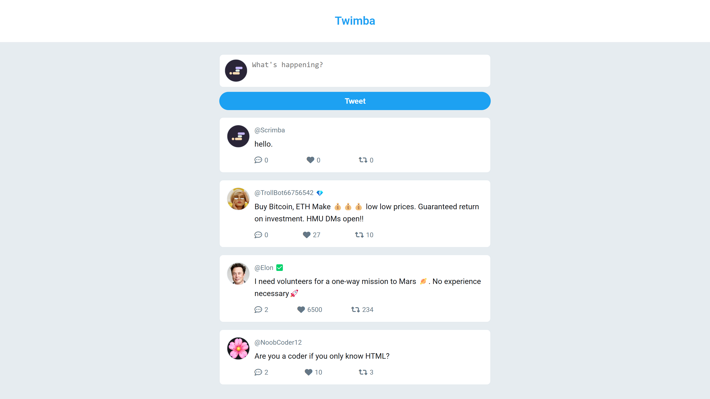

# Twimba 🐤

<div align="center">
  
  
  
  
  
</div>

## Live

<div align="center">

[](https://twimba-js-scrimba.netlify.app/)
</div>

## Overview

**Twimba is a minimal clone of X (formerly Twitter) built to practice CSS and UI/UX design. It replicates core Twitter functionalities with a focus on clean design and straightforward interactivity.**

## ⚒️ Built With

- **HTML5:** For semantic structure and accessibility.
- **CSS3:** For modern, responsive styling.
- **JavaScript:** To add interactive features.

## 📷 Screenshots

<div align="center">

  
</div>

## Getting Started

To run Twimba locally:

1. **Clone the repository:**
   ```bash
   git clone https://github.com/your-username/twimba.git
   cd twimba

2. **Open the project:**
      - Open the index.html file in your preferred browser.


## 🤝 Contributing
Contributions are welcome! If you have suggestions or improvements, please:

1. **Fork the repository.**
      - Create a feature branch: 
      ```bash
      git checkout -b feature/your-feature-name
      ```

2. **Commit your changes**:
    ```bash
    git commit -m "Add your feature description"
    ```

3. **Push to the branch**:

    ```bash
    git push origin feature/your-feature-name
    ```

4. **Open a pull request**.

## 👤 Author

### Ashwin S Nambiar
- Portfolio: [ashwin.co.in](https://ashwin.co.in)
- GitHub: [@Ashwin-S-Nambiar](https://github.com/Ashwin-S-Nambiar)

---

<div align="center">
Made with ❤️ by Ashwin S Nambiar
</div>
